# Chaos Notebook

This repository contains examples from naturally occuring chaos. I get inspired by the book "Chaos: Making a New Science." You should totally check that book out if you did not read it before. It would change how you see the world. 

This repository contains various examples that demonstrate chaos.

## Logistic and Sinus Maps

Logistic map and sinus map are two one dimensional maps,

The logistic map is given by the equation $`f(x+1) = r \cdot f(x) \cdot (1 - f(x))`$, where $`r`$ is a parameter.

The sinus map is given by the equation $`f(x+1) = \mu \cdot \sin(\pi \cdot f(x))`$ where $`\mu`$ is a parameter.

Above some parameter values, these maps give rise to crazy chaotic behaviour. 

## Graphs for Logistic and Sinus Maps

- Logistic and sinus maps converging

<table>
  <tr>
    <td>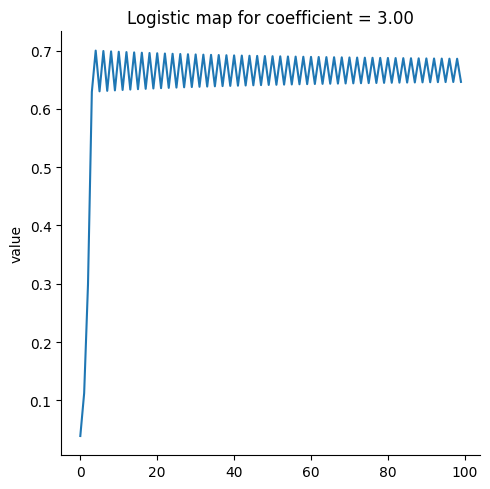</td>
    <td>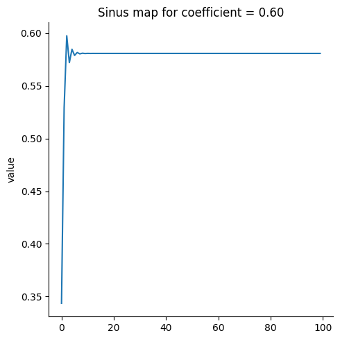</td>
  </tr>
</table>

- Logistic and sinus maps displaying periodic behavior

<table>
  <tr>
    <td>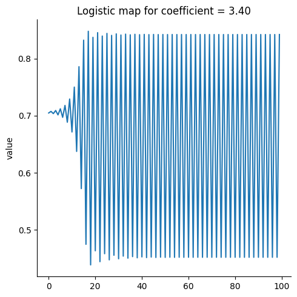</td>
    <td>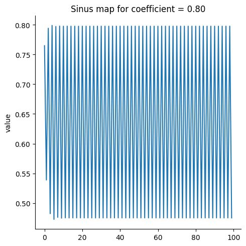</td>
  </tr>
</table>

- Logistic and sinus maps being chaotic

<table>
  <tr>
    <td>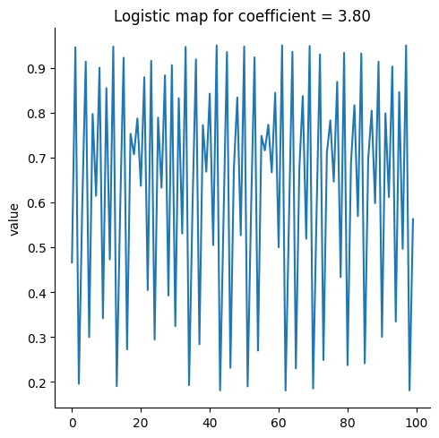</td>
    <td>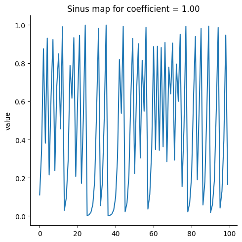</td>
  </tr>
</table>

## Bifurcation Diagrams for Logistic and Sinus Maps

Interestingly, both maps give rise to very similar bifurcation diagrams. In fact, they are exactly the same bifurcation diagrams. Thus, the process is independent of the function chosen. Feigenbaum proved this in his 1978 [paper](https://link.springer.com/article/10.1007/BF01020332). It is an interesting and challenging read.

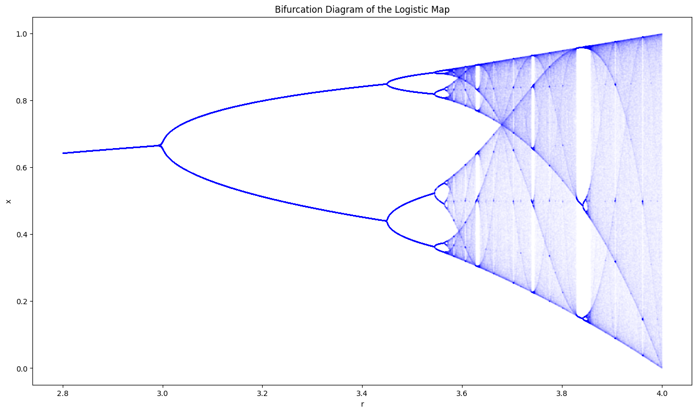</td>

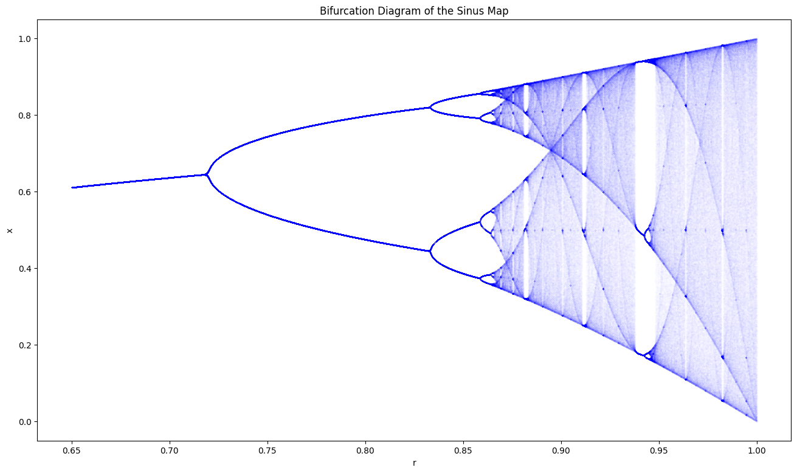

## Double Pendulum

The double pendulum gives rise to chaotic behavior. Below is the trace of the second bob of a double pendulum. Look to the notebook to see the underlying animation.

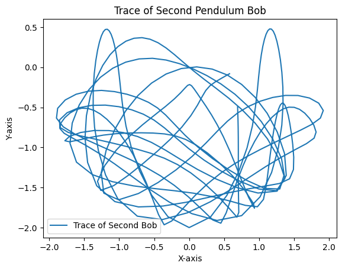

## Lorenz Attractor

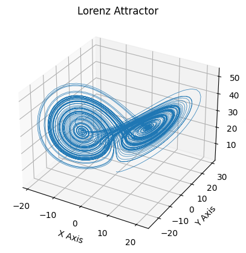

## Horseshoe Map

Horseshoe map is another chaotic map. It is like squashing a dough in two, and repeating the process.

    

        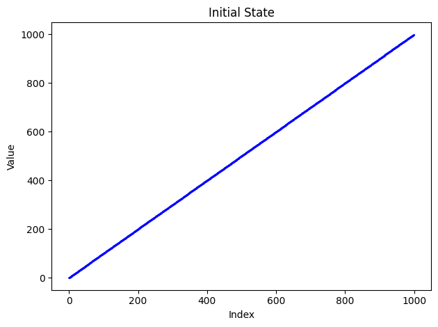
        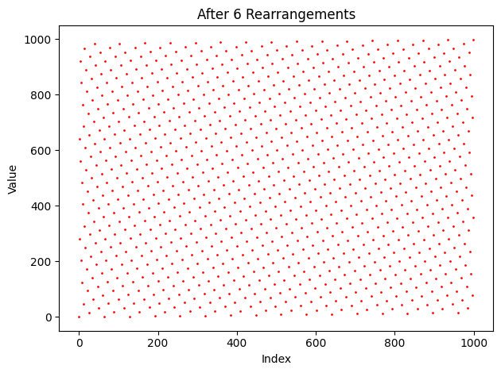
    

    

        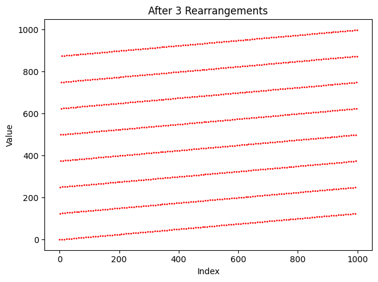
        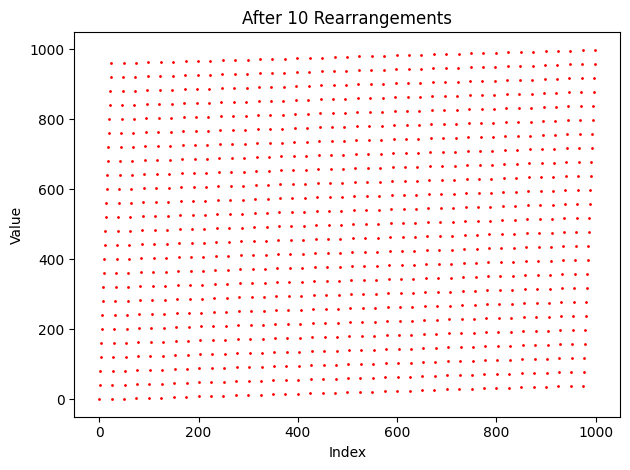
    

